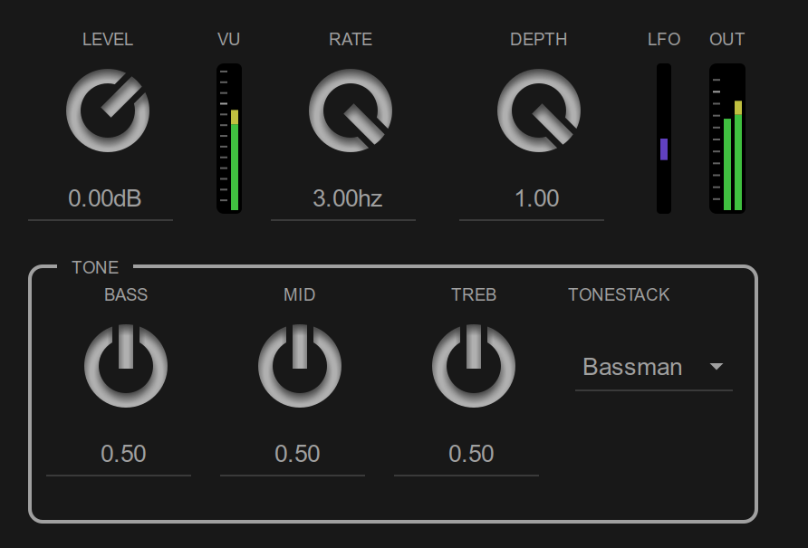

# LVTK

  
0.0.0-prerelease 

Pre-release. APIs are not currently stable.

LVTK is a C++ class library for building LV2 plugins with custom user interfaces, using Cairo/X11 as a graphics backend.

Go to the [Web Page](https://rerdavies.github.io/lvtk)

Go to the [Documentation](https://rerdavies.github.io/lvtk#/documentation/index)

